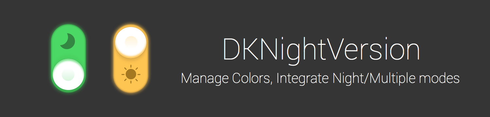
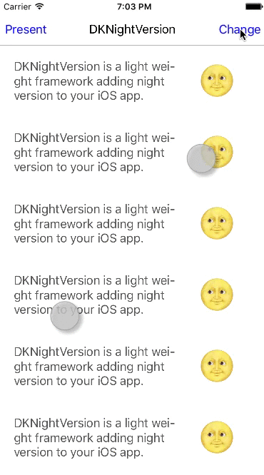

<p align="center">
<a href="https://img.shields.io/badge/Language-%20Objective--C%20-orange.svg"></a>
<a href="http://cocoadocs.org/docsets/DKNightVersion"></a>
<a href="https://travis-ci.org/Draveness/DKNightVersion"></a>

<a href="https://img.shields.io/badge/platform-%20iOS%20-lightgrey.svg"></a>
</p>

- [x] `UIColor` support
- [x] `UIImage` and `UIImageView` support
- [x] Hight performance
- [x] Providing UIKit categoty
- [x] Providing CoreAnimation categoty
- [x] Easily integrate to iOS App
- [x] Based on `objc/runtime`
- [x] Generate by ruby script
- [ ] Default DKColorPicker
- [ ] Support NSAttributedString

# Demo



# Installation with CocoaPods

[CocoaPods](https://cocoapods.org/) is a dependency manager for Objective-C, which automates and simplifies the process of using 3rd-party libraries like DKNightVersion in your projects. See the [Get Started section](https://cocoapods.org/#get_started) for more details.

## Podfile

Run following script in termianl

```shell
$ pod update
```

Add this line to your `podfile`

```shell
pod "DKNightVersion", "~> 1.1.0"
```

## Usage

Just add one line of code in your precompiled header, or import it where you need.

```objectivec
#import "DKNightVersion.h"
```

----

# How to use

## Night color

DKNightVersion is based on picker, such as `dk_backgroundColorPicker` `dk_separatorColorPicker` and etc. Assign the night mode color picker you want to the `UIKit` component like this:

```objectivec
self.tableView.dk_backgroundColorPicker =  DKColorWithRGB(0xffffff, 0x343434);
self.tableView.dk_separatorColorPicker = DKColorWithRGB(0xaaaaaa, 0x313131);
navigationLabel.dk_textColorPicker = DKColorWithColors([UIColor blackColor], [UIColor whiteColor]);
```

## Night Image

DKNightVersion providing new `API` to support image switching.

```objectivec
imageView.dk_imagePicker = DKImageWithNames(@"normal1", @"night1");
```


## DKColor

`DKColor` provides `- pickerWithNormalColor:nightColor:` to create `DKColorPicker`.

```objectivec
DKColorPicker DKColorWithRGB(NSUInteger normal, NSUInteger night);
DKColorPicker DKColorWithColors(UIColor *normalColor, UIColor *nightColor);
```

`DKColor` also provides a cluster of convienient `API` like `UIColor` which returns `DKColorPicker` block, these block return the same color when switch to night mode or switch back.

```objectivec
+ (DKColorPicker)pickerWithUIColor:(UIColor *)color;
+ (DKColorPicker)colorWithWhite:(CGFloat)white alpha:(CGFloat)alpha;
+ (DKColorPicker)colorWithHue:(CGFloat)hue saturation:(CGFloat)saturation brightness:(CGFloat)brightness alpha:(CGFloat)alpha;
+ (DKColorPicker)colorWithRed:(CGFloat)red green:(CGFloat)green blue:(CGFloat)blue alpha:(CGFloat)alpha;
+ (DKColorPicker)colorWithCGColor:(CGColorRef)cgColor;
+ (DKColorPicker)colorWithPatternImage:(UIImage *)image;
#if __has_include(<CoreImage/CoreImage.h>)
+ (DKColorPicker)colorWithCIColor:(CIColor *)ciColor NS_AVAILABLE_IOS(5_0);
#endif

+ (DKColorPicker)blackColor;
+ (DKColorPicker)darkGrayColor;
+ (DKColorPicker)lightGrayColor;
+ (DKColorPicker)whiteColor;
+ (DKColorPicker)grayColor;
+ (DKColorPicker)redColor;
+ (DKColorPicker)greenColor;
+ (DKColorPicker)blueColor;
+ (DKColorPicker)cyanColor;
+ (DKColorPicker)yellowColor;
+ (DKColorPicker)magentaColor;
+ (DKColorPicker)orangeColor;
+ (DKColorPicker)purpleColor;
+ (DKColorPicker)brownColor;
+ (DKColorPicker)clearColor;
```

## DKColorTable

If you have the same `DKColorPicker` for different UIKit components, use `DKColorTable` to save them and take out of them with `DKPickerFromTable(NSString *key)` function.

DKColorTable provides three methods and a C function to manipulate color table and get picker from it.

```objectivec
DKPickerFromTable(NSString *key)

+ (void)addPicker:(DKColorPicker)picker withKey:(NSString *)key;
+ (DKColorPicker)removePickerWithKey:(NSString *)key;
+ (DKColorPicker)pickerWithKey:(NSString *)key;
```


## DKImage

DKImage is similar with DKColor which contains methods to generate `DKImagePicker`

```objectivec
DKImagePicker DKImageWithNames(NSString *normal, NSString *night);
DKImagePicker DKImageWithImages(UIImage *normal, UIImage *night);
```


## Using DKNightVersionManager change theme

Use `DKNightVersionManager` sets the theme.

```objectivec
[DKNightVersionManager nightFalling];
```

If you'd like to switch back to normal mode:

```objectivec
[DKNightVersionManager dawnComing];
```

It's pretty easy to swich theme between night and normal mode.

## Make your own customize

### Notification

`nightFalling` method will post `DKNightVersionNightFallingNotification` when it is called. Similarly, `dawnComing` will post `DKNightVersionDawnComingNotification`. You can observe these notification in proper place, and make your own customize easily.

# Contribute

Feel free to open an issue or pull request, if you need help or there is a bug.

# Contact

- Powered by [Draveness](http://github.com/draveness)
- Personal website [Draveness](http://draveness.me)

# Todo

- Documentation

# License

DKNightVersion is available under the MIT license. See the LICENSE file for more info.

The MIT License (MIT)

Copyright (c) 2015 Draveness

Permission is hereby granted, free of charge, to any person obtaining a copy
of this software and associated documentation files (the "Software"), to deal
in the Software without restriction, including without limitation the rights
to use, copy, modify, merge, publish, distribute, sublicense, and/or sell
copies of the Software, and to permit persons to whom the Software is
furnished to do so, subject to the following conditions:

The above copyright notice and this permission notice shall be included in all
copies or substantial portions of the Software.

THE SOFTWARE IS PROVIDED "AS IS", WITHOUT WARRANTY OF ANY KIND, EXPRESS OR
IMPLIED, INCLUDING BUT NOT LIMITED TO THE WARRANTIES OF MERCHANTABILITY,
FITNESS FOR A PARTICULAR PURPOSE AND NONINFRINGEMENT. IN NO EVENT SHALL THE
AUTHORS OR COPYRIGHT HOLDERS BE LIABLE FOR ANY CLAIM, DAMAGES OR OTHER
LIABILITY, WHETHER IN AN ACTION OF CONTRACT, TORT OR OTHERWISE, ARISING FROM,
OUT OF OR IN CONNECTION WITH THE SOFTWARE OR THE USE OR OTHER DEALINGS IN THE
SOFTWARE.
